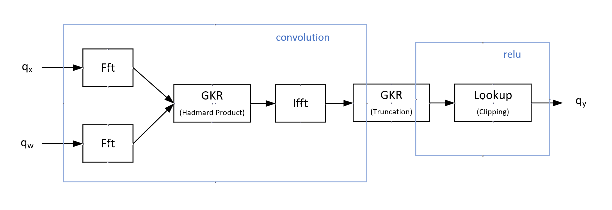

Convolution is one of the most common operations in CNN and usually there is an activation function (e.g. relu) in sequence. 
We use some interactive oracle proof techniques to validate the computation integrity of convolution + relu in this work, which means that the computational process of convolution + relu is verifiable, and an honest prover should always pass the verification in relatively short time or a dishonest prover is always rejected.
We use the GKR protocol and the efficient fft-sumcheck algorithm in [ZKCNN](https://eprint.iacr.org/2021/673) to prove the convolution operation. 
For the non-linearity part (relu), we adopt a different strategy. In ZKCNN, the relu function is proved through GKR circuits by bit decomposition and requires additional auxiliary inputs. 
This means that each element after convolution will spawn several bit operation gates, causing great computational cost. 
In contrast, we use a technique called lookup table which is more efficient in proving snark-unfriendly operations. 
In order to compatible with GKR, the lookup argument called [multivariate lookups](https://eprint.iacr.org/2022/1530) is also based on sumcheck. 
This work is incomplete and ongoing, the polynomial commitment hasn't  been considered.

The sumcheck used throughout this work is a more generalized form, which is a collection of products of multivariate polynomials. 
The GKR protocol, as well as multivariate lookups, are natural instances of this form. Here, $H$ represents the initial claim from the prover.  

Another challenge lies in the incompatibility between the data types used in CNNs and those required by ZK-SNARKs. Most neural networks operate in $\mathbb{R}$, whereas ZK-SNARKs function within a finite field $\mathbb{F}_p$. To bridge this gap, 
we employ a [quantization method](https://arxiv.org/abs/1712.05877) that converts floating-point numbers into integers with minimal loss of accuracy.

After quantization, the ReLU operation simplifies to a clipping function, transforming the entire convolution + ReLU layer into a computation described as follows (assuming 8-bit unsigned integer quantization for the float data):

The zero point for ReLU quantization is always zero. Consequently, the task reduces to proving a standard integer convolution followed by clipping to ensure the values remain within the range [0, 256). The workflow is summarized below.

This implementation leverages the [Arkworks libraries](https://arkworks.rs).